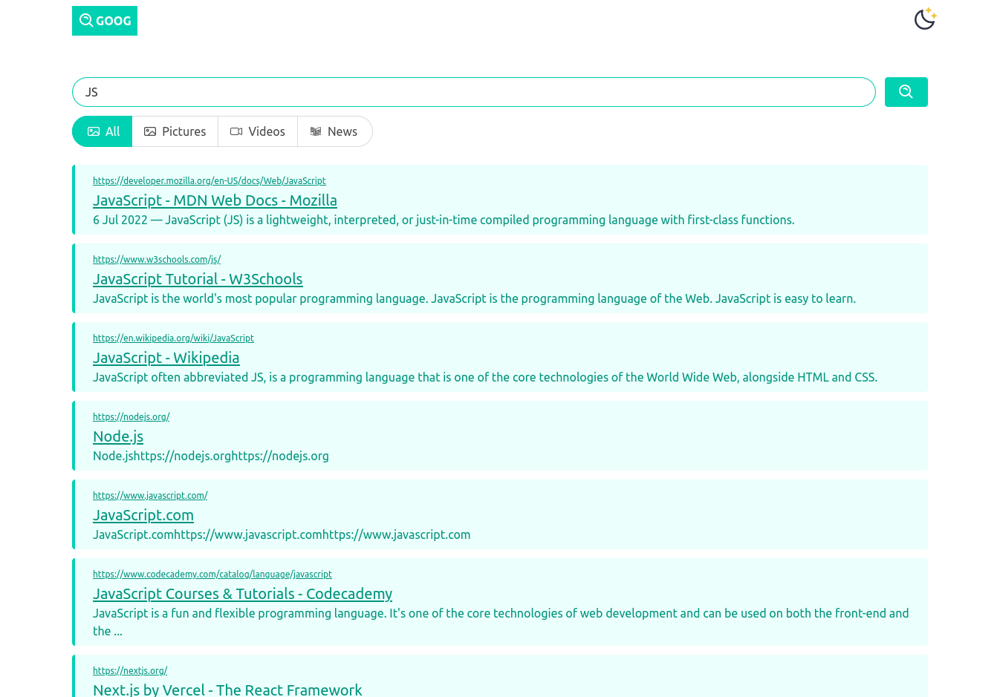

# Getting Started with GOOG

## Used Tools

- [`bulma`](https://bulma.io)
- [`react-icons`](https://react-icons.github.io/react-icons)
- [`react-loader-spinner`](https://mhnpd.github.io/react-loader-spinner-example/)
- [`use-debounce`](https://www.npmjs.com/package/use-debounce)
- [`react-player`](https://www.npmjs.com/package/react-player)
- [`sass`](https://sass-lang.com/)
- [`google-search3`](https://rapidapi.com/apigeek/api/google-search3)

## Upcoming Features

- [`duckduckgo bang`](https://duckduckgo.com/bang)
- [`Google Search Operator`](https://support.google.com/websearch/answer/2466433)
